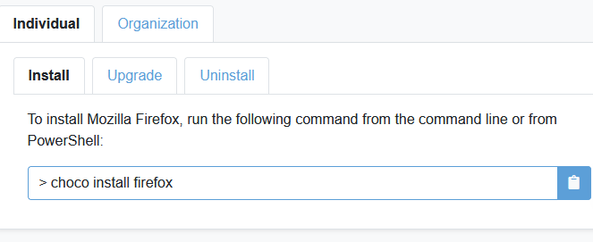

# Chocolatey

## What is Chocolatey?
Chocolatey is a command line application installer for Windows based on a developer-centric package manager called NuGet. Unlike manual installations, Chocolatey adds, updates, and uninstalls programs in the background requiring very little user interaction.

Chocolatey has its own package feed that is created and maintained by the project’s community members.

Behind the scenes, most Chocolatey packages simply download a program’s official executable and install it without any further interaction from the user.

## Advantages?
* Mainly installs programs from official source.
* Easy ‘one click’ (better: one command) solution to download and update software.
* Huge variety of available and maintained programs.
* Still control over updating schedule.
* No need to manually check for updates.

## How does it work?
1.	Install Chocolatey (via PowerShell)
2.	Check which program you want to install (via [their website](https://community.chocolatey.org/packages))
3.	Install them via PowerShell
4.	Keep them up-to-date / other maintenance tasks


### Install Chocolatey
Open PowerShell as Admin and run
```
@powershell -NoProfile -ExecutionPolicy Bypass -Command "iex ((New-Object System.Net.WebClient).DownloadString('https://chocolatey.org/install.ps1'))" && SET "PATH=%PATH%;%ALLUSERSPROFILE%\chocolatey\bin"
```
Done. More info: [Chocolatey Documentation](https://chocolatey.org/install).

### Check which program you want to install
On the [Chocolatey Website](https://community.chocolatey.org/packages) you can find all available packages. For each package you can find detailed information about the software, installation, upgdate and uninstallation commands.

Using the example of [Firefox](https://community.chocolatey.org/packages/Firefox#install):



You can find the relevant commands as well as additional Parameters available for the installation command. E.g. if you want to create a Taskbar Shortcut, deactivate auto update, etc. The available Parameters always depend on the software you want to install.


### Install software via PowerShell

If you now want to install Firefox using Chocolatey, you simply open PowerShell (Admin Privileges) and pass the, on the website given, command. For Firefox:

```
choco install firefox
```

Example of using additional Parameters. E.g. you don’t want a Desktop Shortcut:

```
choco install firefox --params "/NoDesktopShortcute"
```

Chocolatey will now download Firefox from the official source and install it on your machine (the standard directory for installation is: ProgramData\chocolatey\lib)
Of course, you can also install multiple programs at once. For example:

```
choco install firefox atom notepadplusplus zotero
```

If you need to set up multiple machines or reinstall windows regularly, you can create a batch file. In the example .bat file below, each program is listed on a new line to have a cleaner overview (the -y parameter is used to skip the confirmation within PowerShell):

```bat
:::::::::: Personal install script

:::: Install choco .exe and add choco to PATH
@powershell -NoProfile -ExecutionPolicy Bypass -Command "iex ((New-Object System.Net.WebClient).DownloadString('https://chocolatey.org/install.ps1'))" && SET "PATH=%PATH%;%ALLUSERSPROFILE%\chocolatey\bin"

:::::: Cleans temp files once a week
choco install choco-cleaner -y

:::::: Install all the packages
:::: Browsers
choco install firefox -y
choco install googlechrome -y
choco install ungoogled-chromium -y

:::: Text editors / IDEs
choco install atom -y
choco install notepadplusplus -y
choco install texstudio -y
choco install vscode --params "/NoDesktopIcon /NoContextMenuFiles /NoContextMenuFolders" vscode --params "/NoDesktopIcon /NoContextMenuFiles /NoContextMenuFolders" -y
```

The complete .bat file I use can be found [here](/Chocolatey_myInstallScript.bat).


### Keep software up-to-date / other maintenance tasks

To check for available updates, run

```choco outdated```  (lists available updates)

To update a specific program (example: Firefox)

```choco upgrade firefox```

To update all programs:

```choco upgrade all```

More info: [Chocolatey Documentation](https://docs.chocolatey.org/en-us/choco/commands/upgrade)

**Other useful commands:**

To list all installed packages

```choco list --local-only```

To delete a package (example Firefox):

```choco uninstall firefox```

To freeze program updates (don’t update with the upgrade command), you can either pin the current version:

```choco pin firefox``` (won’t update until unpinned) or

```choco upgrade all --except="firefox"``` (skip an update once)


More info: [Chocolatey Documentation](https://docs.chocolatey.org/en-us/choco/commands/pin#mainContent)

**Cleaning Cache - free up space**

To free up disk space by deleting unnecessart residual files (such as old installation files, log files, etc.), I recommend installing the (unofficial) Choco Cleaner script:

```choco install choco-cleaner```

More info: [(unofficial) Choco Cleaner (Script + Task)](https://community.chocolatey.org/packages/choco-cleaner)
