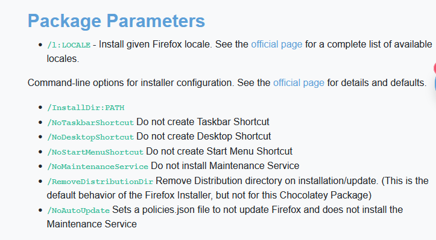

# Chocolatey

## What is Chocolatey?
Chocolatey is a developer-centric package manager that allows you to install and update Windows applications through a command line interface. Unlike manual installations, Chocolatey handles the process of adding, updating, and uninstalling programs in the background, requiring very little user interaction.

The project is community-driven, and the package feed is maintained by members of the Chocolatey community.

Most Chocolatey packages are designed to download an application's official executable and install it without further user interaction.

## Advantages?
* Chocolatey installs programs mainly from official sources, ensuring that you get the latest and most secure versions.
* It provides an easy 'one click' solution for downloading and updating software, with a vast selection of available and well-maintained programs.
* You still have control over the updating schedule, and there's no need to manually check for updates.

## How does it work?
1.	Install Chocolatey via PowerShell.
2.	Check the Chocolatey website for the programs you want to install. ([the website](https://community.chocolatey.org/packages))
3.	Install them via PowerShell
4.	Keep your programs up-to-date with Chocolatey & other maintenance tasks.


### Install Chocolatey
To install Chocolatey, open PowerShell as an administrator and run the following command:
```
@powershell -NoProfile -ExecutionPolicy Bypass -Command "iex ((New-Object System.Net.WebClient).DownloadString('https://chocolatey.org/install.ps1'))" && SET "PATH=%PATH%;%ALLUSERSPROFILE%\chocolatey\bin"
```
For more information, see the the [Chocolatey Documentation](https://chocolatey.org/install).

### Check which program you want to install
The [Chocolatey Website](https://community.chocolatey.org/packages) lists all available packages. For each package, you can find detailed information about the software, installation, update, and uninstallation commands.


For example, if you want to install [Firefox](https://community.chocolatey.org/packages/Firefox#install), you can find the relevant commands and additional parameters available for the installation command - e.g. to create a taskbar shortcut, configure auto update, etc.




### Install software via PowerShell

To install Firefox using Chocolatey, open PowerShell with administrator privileges and enter the command:

```
choco install firefox
```

Example of using additional Parameters. E.g. you don’t want a Desktop Shortcut:

```
choco install firefox --params "/NoDesktopShortcute"
```

Chocolatey will download Firefox from the official source and install it on your machine (the standard directory for installation is: ProgramData\chocolatey\lib)

You can also install multiple programs at once, or use additional parameters to customize the installation.

```
choco install firefox atom notepadplusplus zotero
```

If you need to set up multiple machines or reinstall windows regularly, you can create a batch file. In the example .bat file below, each program is listed on a new line to have a cleaner overview (the -y parameter is used to skip the confirmation within PowerShell):

```bat
:::::::::: Personal install script

:::: Install choco .exe and add choco to PATH
@powershell -NoProfile -ExecutionPolicy Bypass -Command "iex ((New-Object System.Net.WebClient).DownloadString('https://chocolatey.org/install.ps1'))" && SET "PATH=%PATH%;%ALLUSERSPROFILE%\chocolatey\bin"

:::::: Cleans temp files once a week
choco install choco-cleaner -y

:::::: Install all the packages
:::: Browsers
choco install firefox -y
choco install googlechrome -y
choco install ungoogled-chromium -y

:::: Text editors / IDEs
choco install atom -y
choco install notepadplusplus -y
choco install texstudio -y
choco install vscode --params "/NoDesktopIcon /NoContextMenuFiles /NoContextMenuFolders" vscode --params "/NoDesktopIcon /NoContextMenuFiles /NoContextMenuFolders" -y
```

The complete .bat file I use can be found [here](/Chocolatey_myInstallScript.bat).


### Keep software up-to-date / other maintenance tasks

To check for available updates, run

```choco outdated```  (lists available updates)

To update a specific program, use the command (example firefox):

```choco upgrade firefox```

To update all programs, use:

```choco upgrade all```

More info: [Chocolatey Documentation](https://docs.chocolatey.org/en-us/choco/commands/upgrade)

**Other useful commands:**

Chocolatey also provides other useful commands, such as listing all installed packages and freezing program updates.

To list all installed packages

```choco list --local-only```

To delete a package (example Firefox):

```choco uninstall firefox```

To freeze program updates (don’t update with the upgrade command), you can either pin the current version:

```choco pin firefox``` (won’t update until unpinned) or

```choco upgrade all --except="firefox"``` (skip an update once)


More info: [Chocolatey Documentation](https://docs.chocolatey.org/en-us/choco/commands/pin#mainContent)

**Cleaning Cache - free up space**

To free up disk space by deleting unnecessart residual files (such as old installation files or log file), I recommend installing the (unofficial) Choco Cleaner script:

```choco install choco-cleaner```

More info: [(unofficial) Choco Cleaner (Script + Task)](https://community.chocolatey.org/packages/choco-cleaner)
